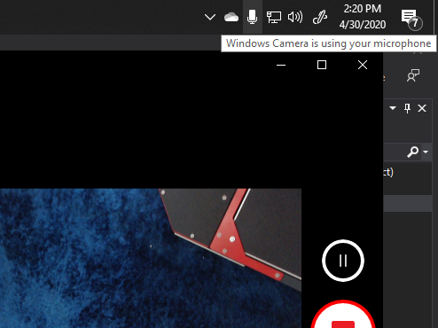
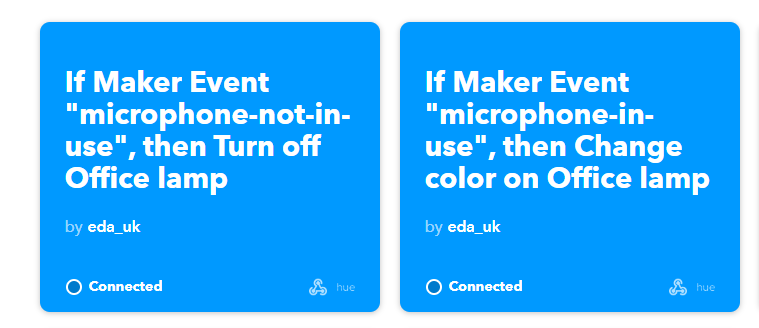

# CallStatusToIFTTT


Small application that monitors your microphone status on Windows 10 Creators Update or newer and posts to a IFTTT webhook when your microphone becomes in use and when it stops being in use.

To do this, it monitors the status bar icon that Windows 10 provides:



However, there is no API to do this so it uses some gnarly Interop code to read the status bar. This stuff [genuinely came from a Code Project article from 2005!](https://www.codeproject.com/articles/10497/a-tool-to-order-the-window-buttons-in-your-taskbar) And still works even in .NET Core!

To launch, open the exe file with a single launch parameter - that being your IFTTT webhook key which you can get [from this page](https://ifttt.com/maker_webhooks/settings).

For example:

```
DotNetEd.CallStatusToIfttt.exe myiftttwebhookkey
```

The app sends the following two events:

| Webhook event name | when sent |
| --- | --- |
| microphone-is-on | when microphone starts to be in use |
| microphone-is-not-on | when microphone stops being in use |

You can then set up IFTTT like the following:



## Example uses

- Make the lights outside your office go Red when you are on a call. Train kids!
- Set your hifi to mute
- Turn on coffee machine

etc

